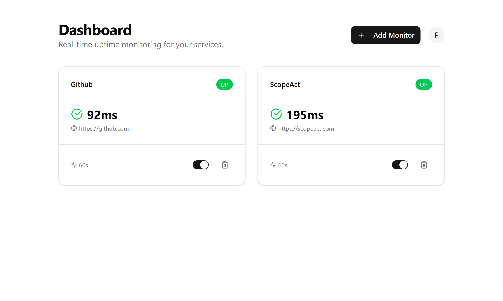

# 🛰️ Simple Uptime Monitor

<div align="left">
  

  
</div>
<br />

Um sistema de monitoramento de sites focado em performance e arquitetura distribuída. Construído para ser leve, seguro e fácil de hospedar.



## 💡 Por que este projeto?

A maioria dos clones de Uptime Robot por aí usa loops simples dentro de rotas da Vercel para checar os sites. Isso não escala e morre por **timeout**. 

Neste projeto, eu quis demonstrar uma arquitetura de "gente grande":
- **O App (Next.js 16):** É apenas o painel de controle e a API.
- **O Motor (Cloudflare Workers):** Os pings rodam na borda (Edge), em uma infraestrutura separada, garantindo que o monitoramento nunca pare, independente da carga no banco de dados ou no servidor principal.

## 🛠️ O que tem debaixo do capô?

- **Framework:** Next.js 16 (App Router)
- **Linguagem:** TypeScript (Type-safe)
- **Banco de Dados:** PostgreSQL via Prisma ORM (com índices compostos para gráficos velozes)
- **Autenticação:** Auth.js v5 (Suporte a GitHub OAuth e Email/Senha com hash seguro)
- **UI:** Tailwind CSS + Shadcn/UI (Design focado em UX)
- **Gráficos:** Recharts para visualização de latência das últimas 24h
- **Agente de Monitoramento:** Cloudflare Workers (Execução na borda com Cron Triggers)

## 🚀 Decisões de Engenharia (O Diferencial)

### 1. Arquitetura Desacoplada
Em vez de sobrecarregar a Vercel, criei um agente externo que roda em Cloudflare Workers. Ele acorda a cada minuto, busca os alvos via API secreta e devolve os resultados em lote (bulk insert). Isso evita o overhead de abrir centenas de conexões HTTP no servidor principal.

### 2. Segurança Multi-tenant
O sistema foi desenhado para ser um SaaS. Cada usuário só enxerga seus dados. Usei filtros rigorosos no Prisma (`userId`) em todas as Server Actions para evitar vulnerabilidades de IDOR (Insecure Direct Object Reference). Se você tentar deletar um monitor que não é seu pelo ID, o sistema simplesmente nega.

### 3. Performance de Banco de Dados
Gráficos de latência podem ficar lentos conforme o histórico cresce. Para resolver isso, a tabela de `Pings` usa índices compostos em `(monitorId, createdAt)`. O resultado? Gráficos que carregam instantaneamente mesmo com milhares de registros no log.

## 📦 Como rodar o projeto

1. **Clone e Instale:**
   ```bash
   git clone https://github.com/felipevetter/simple-uptime-monitor.git
   cd simple-uptime-monitor
   npm install
   ```

2. **Configure as Variáveis:**
   Crie um arquivo `.env` baseado no `.env.example` e preencha com suas chaves do Neon (Postgres), GitHub OAuth e um segredo para o Worker.

3. **Inicie o Banco:**
   ```bash
   npx prisma migrate dev
   ```

4. **Suba o Motor (Cloudflare Worker):**
   O código do agente está na pasta `/worker`. Basta colar no painel da Cloudflare e configurar a URL da sua API e o `WORKER_SECRET`.

## 📈 Roadmap / Próximos Passos
- [ ] Alertas via Telegram/Discord quando um site cair.
- [ ] Status Pages públicas para compartilhar com clientes.

---
Desenvolvido por Felipe Vetter - Conecte-se comigo no [LinkedIn](https://www.linkedin.com/in/felipevetter/).